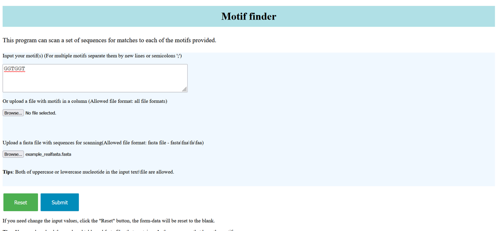
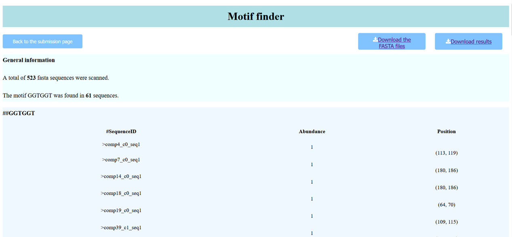

# README - MOTIF finder

## About the program

MOTIF finder is a tool that scans a set of sequences for a given motif (or multiple motifs) and gives information about which sequences have the motif, how many times and at what position.

It exists as a web application (web_MOTIFs_finder.py) and as command line tool (MOTIFs_finder.py).


## Command line tool

### Installation

The tool in written in Python (v3.8.8).

### Running the program

There are various options when running the program via the command line, depending on what the user wants to achieve. To read about the options of the program simply run:

```bash
python MOTIFs_finder.py --help
```


 Flag options:
 - --file: retrieve the sequence from a file in fasta format.
 - --motif: manually enter the motif or multiple motifs for search. Separate the motifs with space.
 - --motif_file: retrieve the motif or multiple motis from a file. In the case of multiple motifs they have to be in a single column.
 - --outSeq: creates a new fasta file per motif, that contains only the sequences that have the motif. No argument is provided.
 - --outMotif: creates a tsv file with the tab-separated table containing the motif information. As argument it takes the desired file name.


 The --outSeq and --outMotif flags are optional.

 The --file flag is mandatory. The --motif or the --motif_file flag has to be used.

 An example run would look like this, using one of the example sequences and their motif:

  ```bash
  python MOTIFs_finder.py --file ../examplefiles/example_realfasta.fasta --motif GGTGGT --outSeq --outMotif motif_table.tsv
  ```

 ### Results

The program prints a tab-separated table with the information regarding the motif. The table contains three columns, the first one has the sequence ids of the sequences that have the motif, the second column has the number of times the motif was found in that sequence and the third column has the start and end position of the motif in the sequence. The program can output this table in a tsv file if the appropriate flag is used. It can also produce a new fasta file that contains only the sequences that have the motif, if the appropriate flag is used.


-------------------------------------------------------------------


## Web tool

To run the web application the prerequisites are:
- Python version 3.x
- Conda version 4.x


### Installation


```bash
# install the Flask package in a virtual environment using conda
conda create -n motifenv python=3.8.8 flask

# activate the environment
conda activate motifenv

# check whether the flask package was installed successfully
flask --version
Python 3.8.8
Flask 2.0.2
Werkzeug 2.0.3
```


### Running the program

```bash
python web_MOTIFs_finder.py
# Press "Ctrl + click" to open the web of application
# Press "Ctrl + C" to quit
```

The app will be served at localhost in port 5000.

The interface of the submission page is as follows:




The sequences used in this example are from the file example_realfasta.fasta provided in the examplefiles directory.


### Results

The results are visualized in a new page:




The user can inspect the results and download the table and the fasta sequences that contain the motif by clicking on the corresponding buttons.
